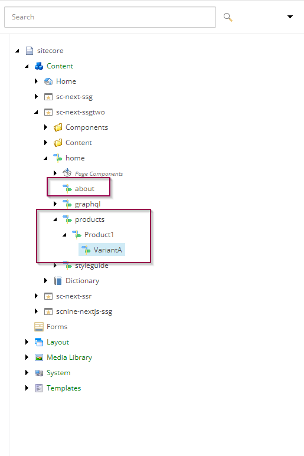

# Sitecore JSS Next.js Sample Application with hybrid SSG + SSR rendering

## Short description

this repository shows the use case of having of Sitecore Headless Next.js website with main SSG rendering. Some paths of the website switched to use SSR rendering mode.
Those paths are:

- ```/about```
- ```/products/*```

In order to get this exampel running make sure you have similar items structure (please use styleguide template). Pay attention to the ```about``` item and the ```products``` subtree. Those items are supposed to be handled by SSR



***Note:*** pay attention that you should update getStaticPaths/sitemap to exclude SSR pages. This is not done in this example repo (at lest yet 😃)
